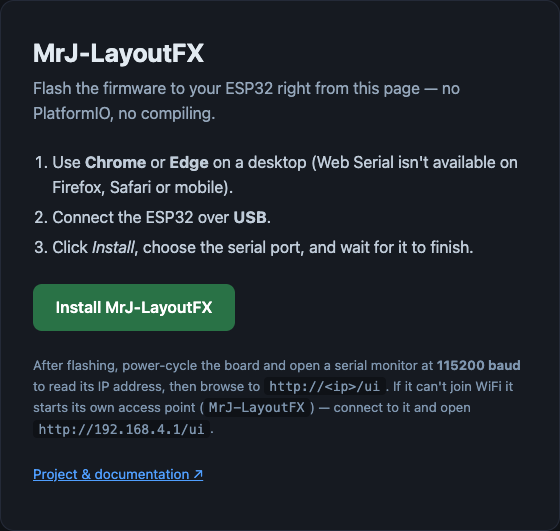
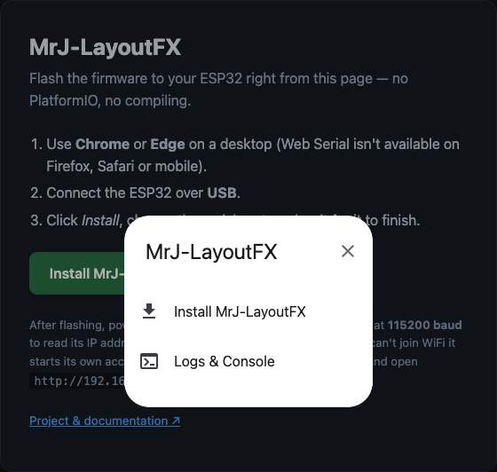
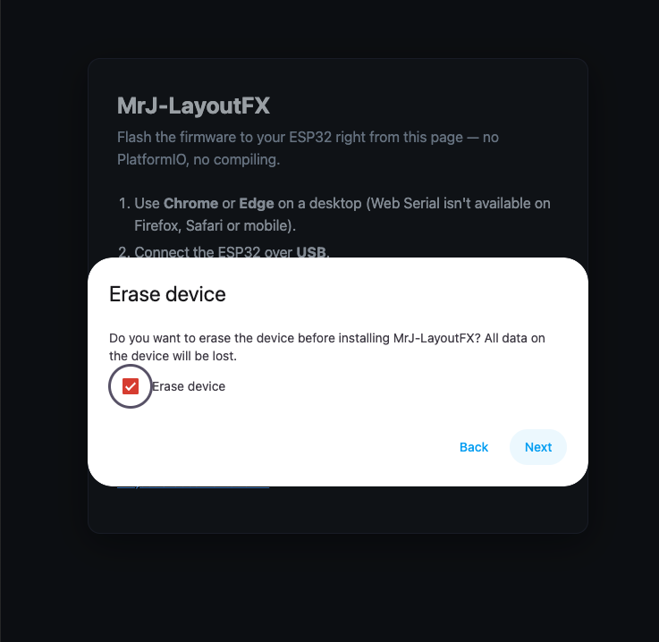
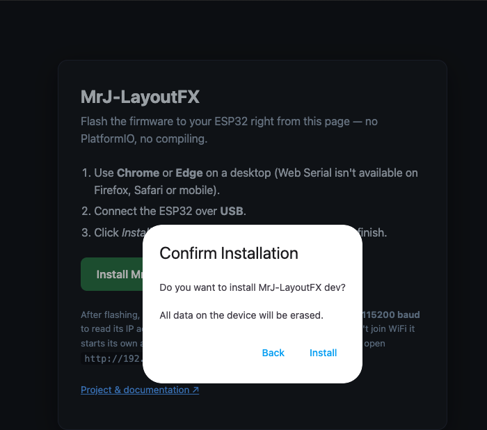
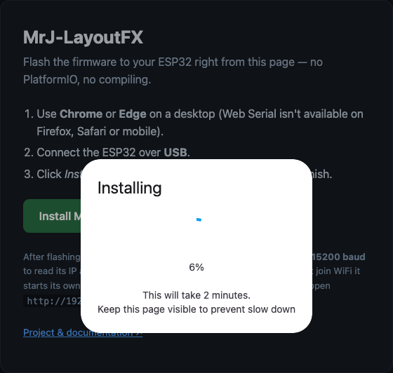
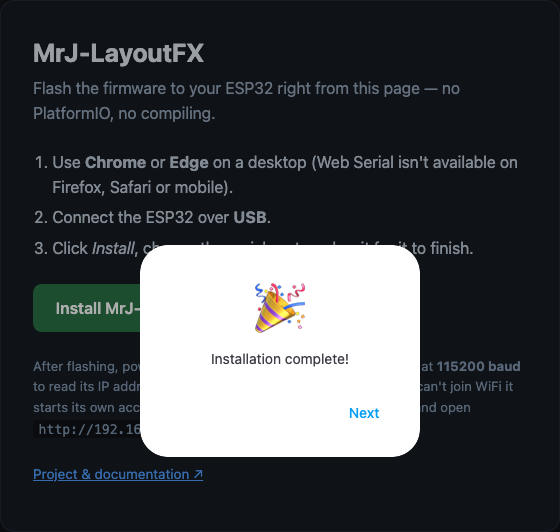
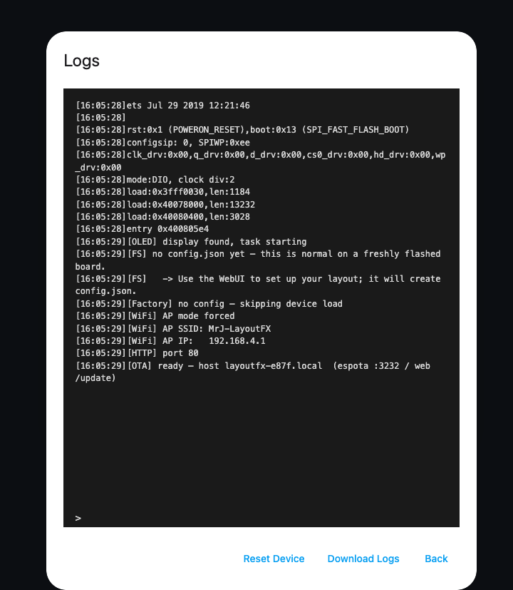
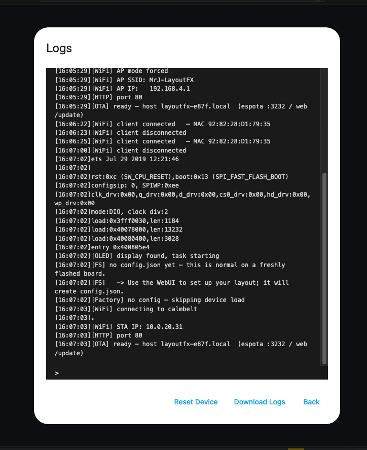

# Web installer (ESP Web Tools)

A WLED-style **browser USB flasher**: end users open a web page, plug their ESP32
in, and click *Install* — no PlatformIO, no compiling. Built on
[ESP Web Tools](https://esphome.github.io/esp-web-tools/) (the Web Serial API).

```
Chrome/Edge ──Web Serial──► USB ──► ESP32
   index.html + manifest.json + bootloader/partitions/boot_app0/app .bin
```

The firmware is self-contained (WebUI + device catalogs live in PROGMEM), so a
fresh flash boots a working WebUI with an **empty config** — the user configures
their layout afterwards from the UI. No filesystem image is shipped.

## Files

| File | Tracked? | Notes |
|---|---|---|
| `index.html` | yes | The install page (the `<esp-web-install-button>`). |
| `manifest.json` | generated | Lists the flash parts + offsets. |
| `*.bin` | generated | bootloader / partitions / boot_app0 / app. |

The `.bin` files and `manifest.json` are produced by
[`../scripts/build_web_installer.py`](../scripts/build_web_installer.py) and are
git-ignored — they are build artifacts (rebuilt locally or in CI).

## Test it locally (now)

```sh
pio run -e web_installer                      # build the firmware
python3 scripts/build_web_installer.py        # collect bins + write manifest
cd web-installer && python3 -m http.server 8000
```

Or, from the repo root, the same three steps via `make`:

```sh
make web-installer          # build + assemble + serve on http://localhost:8000
make web-installer-stop     # stop it
```

(`make web-installer-build` and `make web-installer-serve` run those steps
separately; `PORT=8080 make web-installer` overrides the port.)

`web_installer` is a dedicated, WiFi-agnostic env (`configurations/web_installer/`)
— it does **not** include `configurations/auth/wifi.h`. Don't substitute
`esp32devkitc_breadboard` here: that config bakes in the maintainer's own WiFi
credentials and must never be published as a downloadable binary.

Open **http://localhost:8000** in **Chrome or Edge**, connect the ESP32 by USB,
and click *Install*. (`localhost` counts as a secure context, so Web Serial works
without HTTPS.)

## Publish it (GitHub Pages)

`../.github/workflows/web-installer.yml` builds the firmware, runs the generator
and deploys this folder to GitHub Pages on every `v*` tag. Before it works you must:

1. **Settings → Pages →** set *Source* to **GitHub Actions**.
2. Wire up the firmware-library checkout in the workflow (the lib is a separate
   repo, git-ignored here) — repo name, branch and a token if it's private.

Pages serves over HTTPS, which Web Serial requires.

## Walkthrough

What a first-time user sees, end to end (Chrome, ESP32 DevKitC, fresh board):

| | |
|---|---|
|  **1. The install page** |  **2. Click Install → menu** |
|  **3. Confirm erase** |  **4. Confirm installation** |
|  **5. Flashing…** |  **6. Wrapping up** |
|  **7. Done** |  **8. First boot — AP mode, SSID `MrJ-LayoutFX`** |
|  **9. After WiFi setup — joined the home network** | |

Once flashed, the board starts its own access point (SSID **MrJ-LayoutFX**, no
password) since it has no WiFi credentials yet. Join it and open
`http://192.168.4.1/ui` to enter your home WiFi and configure your layout —
the board then reboots onto your network, as in screenshot 9.

## Browser support

Web Serial is **Chromium-only** (Chrome, Edge, Opera) on **desktop**. Firefox,
Safari and mobile browsers can't flash — the page shows a notice there.

## Not the same as OTA

This flashes a **blank/recovery** device over **USB**. To update a device that is
already running and on WiFi, use the built-in **OTA** (`/update` page, or
`pio run -t upload` / espota). The two are complementary.
